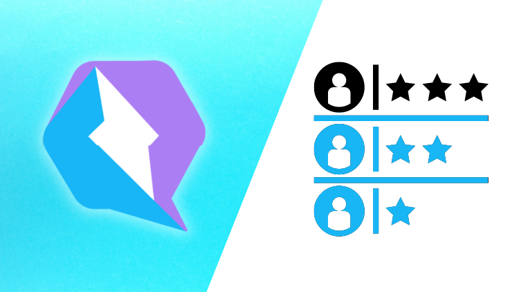

# Curso de Qwik intermedio-avanzado en español

Este curso es una continuación del curso de
[Qwik de nivel principiantes en español](https://www.udemy.com/user/manuel-sanchez-324/). En este curso dejaremos a un lado toda la parte teórica, y nos pondremos mano a la obra a hacer diferentes proyectos.

## Cómo acceder al curso

El curso se encuentra en **UDEMY** y puedes acceder a él a través del siguiente [enlace](https://www.udemy.com/user/manuel-sanchez-324/).

El curso lo estoy haciendo con la versión de **Node 16.15.1**, así que de esa versión en adelante todo debería ir bien.

## Instrucciones para tomar el curso

En el repositorio encontrarás cada uno de los proyectos. A lo largo del curso verás los commits que hago, así que podrás ver más de cerca los cambios para cerciorarte de que entiendes todo a la perfección.

## Contacto

Si te ha gustado este curso y te has quedado con ganas de más, te invito a que le eches un vistazo a [mis demás cursos de Udemy](https://www.udemy.com/user/manuel-sanchez-324/). Además, también puedes subscribirte a mi canal de [YouTube](https://www.youtube.com/channel/UCX3IE_OjG20p_AwbX06YAEg), donde publico de forma periódica contenido interesante sobre Qwik y otras temáticas de frontend.

Si quieres contactar conmigo, puedes hacerlo a través de [manusanchezweb@gmail.com](mailto:manusanchezweb@gmail.com).
