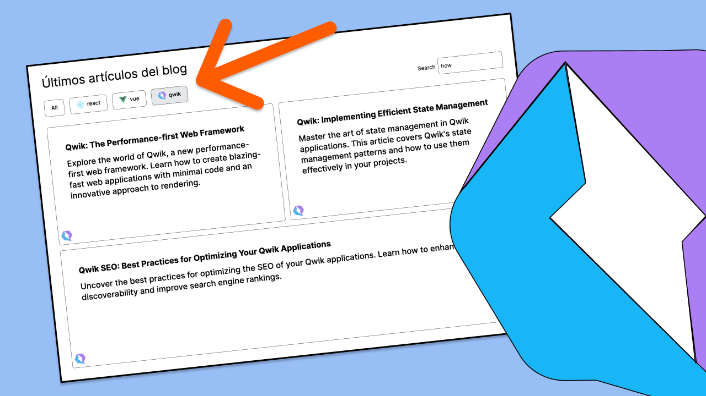

# Curso de Qwik intermedio-avanzado en español

Este curso es una continuación del curso de
[Qwik de nivel principiantes en español](https://www.udemy.com/course/curso-principiantes-qwik/). En este curso dejaremos a un lado toda la parte teórica, y nos pondremos mano a la obra a hacer diferentes proyectos.

## 😁 Cómo acceder al curso

El curso se encuentra en **UDEMY** y puedes acceder a él a través del siguiente [enlace](https://www.udemy.com/course/curso-intermedio-qwik-espanol/?referralCode=3D453D600C0CB529D84B).

## ⌨️ Proyectos

En el repositorio encontrarás cada uno de los proyectos. A lo largo del curso verás los _commits_ que hago, así que podrás ver más de cerca los cambios para cerciorarte de que entiendes todo a la perfección.

- 01: [The Simpsons Quote App](projects/01-simpsons-quote/)
- 02: [The Weather App](projects/02-weather-app/)
- 02: [Capcom Game Advisor](projects/03-capcom-game-advisor/)

## 🚀 Material complementario

Aquí te dejo una selección de enlaces que me parecen interesantes sobre Qwik:

- 01: [Plataforma de documentación de Qwik en español](https://www.manuelsanchezweb.com/cursos/qwik/)
- 02: [Aprender a hacer un filtro con Qwik y motion](https://youtu.be/s5iRQoBfa9s)
- 03: [Crea y despliega una app de películas con Qwik](https://youtu.be/kUiU826tPTU)

## 📧 Contacto

Si te ha gustado este curso y te has quedado con ganas de más, te invito a que le eches un vistazo a [mis demás cursos de Udemy](https://www.udemy.com/user/manuel-sanchez-324/). Además, también puedes subscribirte a mi [Patreon](https://www.patreon.com/manuelsanchezweb) o mi canal de [YouTube](https://www.youtube.com/channel/UCX3IE_OjG20p_AwbX06YAEg), donde publico de forma periódica contenido interesante sobre Qwik y otras temáticas de frontend.

Si quieres contactar conmigo, puedes hacerlo a través de [manusanchezweb@gmail.com](mailto:manusanchezweb@gmail.com).
