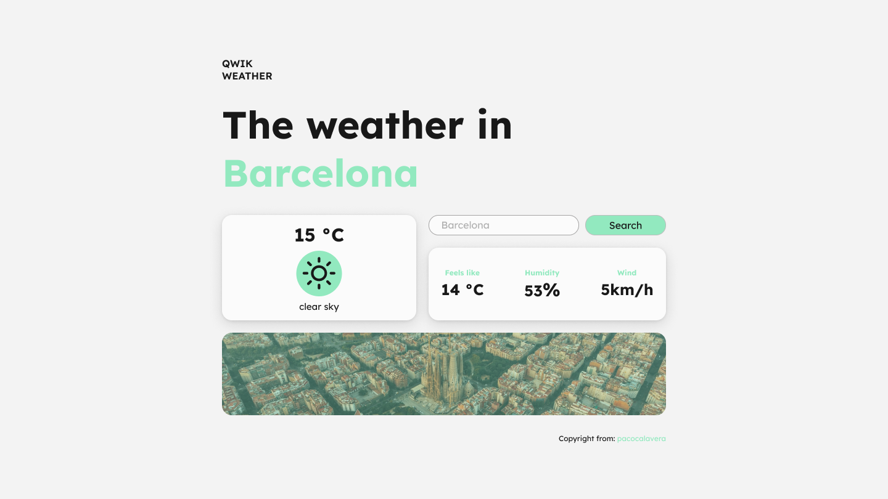

# 🌡️ Weather App

Aplicación del tiempo realizada como parte del curso avanzado de Qwik

## 💾 API e iconos

A continuación tenemos algo de información al respecto:

- 01: [API OpenWeather](https://openweathermap.org/api/)
- 02: [API unsplash para las imágenes](https://unsplash.com/developers/)
- 03: [Icons utilizados en el proyecto](https://erikflowers.github.io/weather-icons/)
